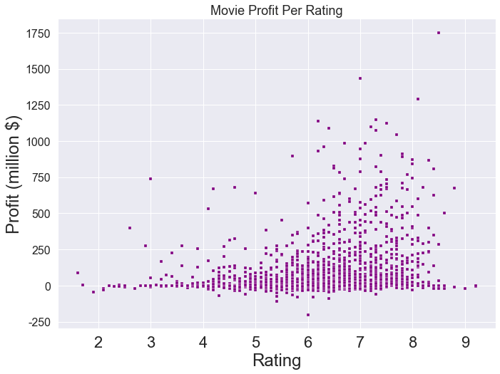
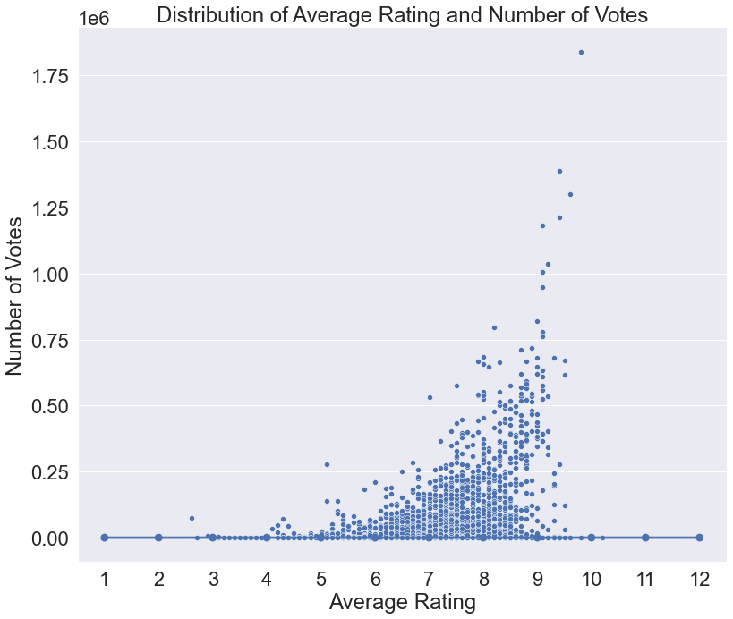
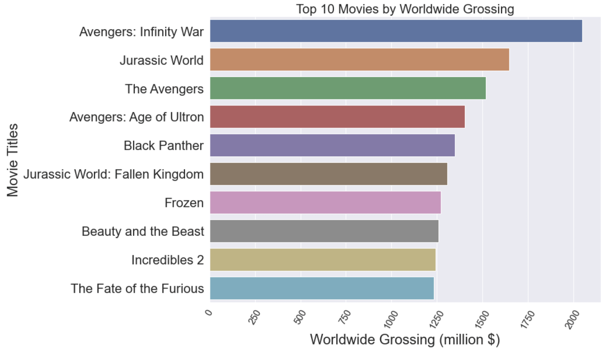

# Phase 1 IMDB Exploratory Data Analysis for Microsoft

## Project Overview

### Business Problem

Microsoft decided to create a new movie studio, but they don’t know anything about creating movies. They want to know what types of films are currently doing the best at the box office.  What characteristic  makes the film more likely to be box office hit.
My resposibility is to explor what types of films are currently doing the best at the box office, and make recomendations based on the finding to help them decide what direction should they take to enter the market.

### The Data

In the folder `zippedData` are movie datasets from:

* [Box Office Mojo](https://www.boxofficemojo.com/)
* [IMDB](https://www.imdb.com/)
* [Rotten Tomatoes](https://www.rottentomatoes.com/)
* [TheMovieDB](https://www.themoviedb.org/)
* [The Numbers](https://www.the-numbers.com/)

During the analysis I will use the following data sources:

#### DataBase tables
 - movie_basics
 - movie_ratings
 
#### CSV file
 - zippedData/tn.movie_budgets.csv.gz
 
### Data overview
I worked with the following following columns from the dataset:
Genre, Realease time, Movie title, Runtime, 
In addition to these information I also created Foreign Gross, Profit, Profitable, and ROI columns.

### Data Cleaning
During the data cleaning process I removed the rows which were missing the genre information.
ALso removed the outliers in the runtime coumn, wich were less than 10 minutes and anything over 300 minutes. After that I filtered the data to only show the movies from 2010 to 2019.

### Analysis

After cleaning the dataset, the analysis should yield information on what genres are the most profitable, what is the average length of a movie in each genre. When is the best time to release a movie and what initial investment amount is requred if Microsoft decide to creat movies in a specific genre.

#### Distribution of Profit Over Rating

After plotting the profit and rating together, it shows that they have no correlation, increasing profit not necessarily lead to higher profit.

Similarly to the previous distribution, the number of votes and average rating also not shows any correlation.  

#### Top 10 movies

The above diagram shows the top 10 movies by worldwide grossing.
Avangers: Infinity War came out as the top grossing movie with worldwide revenue a little over 2 billion $. Then followed by Jurassic World as second with around 1.6 billion $, and finally on the third place The Avangers with the total grossing of 1.5 billion.
It worth to mention that there are two animation movies in the top 10 list, Frozen and the Incredibles 2, with a total gross of 1.25 billion $. This need to be taken into consideration when selecting the target audience, as movies targeted for kids make significant amount of revenue.

These top 10 grossing movies distributed over 3 genres. Action, Animation and Fantasy.

#### Most profitable genres

From all the movies between 2010 and 2019, 63 % of them were profitable, and almost 37% of them cost more money to make than the gross revenue the film earned.
Most profitable genres to make movies are the following: Action, Animation, Fantasy, Adventure and Romance. 

Important to note that my chart shows the History had 100% profitability, however the dataset I used only had two History movies and they both turned out to be profitable.
Besides this there are significant amount of movies in each genre, they represent the profitability for the rest of the genres correctly.

#### Runtime

Optimal length for Action movies is 133 mins, Animation is around 95 mins, for Fantasy - 119, Adventure - 139 mins and  Romance is 110 minutes.

#### Best time to release a movie

Best time to release a movie are falling into the following months: March, September, October and December. This shows some seasonality. From my pesonal experience in each month there are several holidays or school breaks when more people have time to go to the moves, this could explain that increased number of movie releases.

On the graph there are noticable drops in the number of film releases in certain month. I would recomment to avid releaseing movies in these month to maximise the gross revenue.
The month should be avoided are January, February, May, June and July

### Next Steps

If I had more time I would expand the analysis to see how successful are the original movies or those which are based on book adaptation.
Besids the box office revenue, lot of movies make extra revenue through merchandising and licencing. Looking at that information would might change the top 10 movies or their genre distribution. 
In addition to these it would also worth to check the actors / actresses in movies where the initial investment is on the lower side but the Return of Investment is high, might show some patterns for some A listers who attract more people to the movies.

### Recommendations

Based on the analysis the following should be taken into consideration before entering the movie market:

<ul>Most profitable genres to make movies are: 
     <li>Action</li>
     <li>Animation</li>
     <li>Fantasy</li>
     <li>Adventure</li>
     <li>Romance</li>
 </ul>

<ul>Optimal length for top genres:
    <li>Action movies - 133 mins </li>
    <li>Animation - 95 mins</li>
    <li>Fantasy - 119 mins</li>
    <li>Adventure - 139 mins</li>
    <li>Romance - 110 mins</li>
</ul>
<ul>Best time to release a movie:
    <li>March</li>
    <li>September</li>
    <li>October</li> 
    <li>December</li>
</ul>

<ul>Month to avoid release:
    <li>January</li>
    <li>February</li>
    <li>May</li> 
    <li>June</li>
    <li>July</li>
</ul>

In average for each genres the following initial investments are required if the company decides to make a movie in these catergories.
The amount is in million $.

This concludes my exploratory data analysis of IMDB data.

### Thank you.
